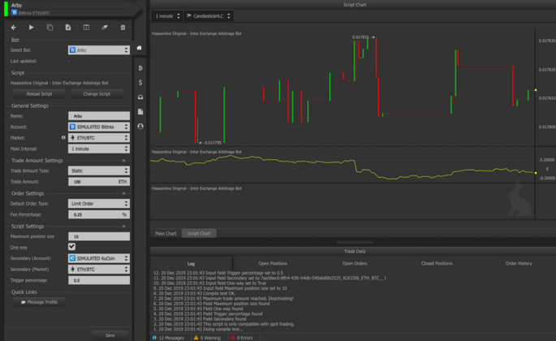

# 🔒 Crypto Address Validator: Secure Blockchain Address Verification | BTC, ETH, SOL, ADA, DOT & More

Crypto Address Validator is an open-source toolkit for validating Bitcoin, Ethereum, Solana, Cardano, and 20+ blockchain addresses. Designed for crypto whales, exchanges, and DeFi platforms, it prevents irreversible transactions using offline checksum verification.

Validate cryptocurrency wallet addresses instantly. Prevent losses from typos, scams, or invalid formats. Trusted by developers and crypto whales.

## 🚀 Key Features
- 100% Offline Validation – No API calls, no data leaks.
- Multi-Format Support:
  - Legacy (BTC: 1...), SegWit (BTC: bc1...), Taproot (BTC: tb1p...)
  - EVM Chains (ETH, BSC, Polygon) with EIP-55 checksum
  - Cosmos SDK chains (ATOM, OSMO) with Bech32
- Enterprise-Grade Security: Audited code, fuzz testing, and hardware wallet integration (Ledger, Trezor).

### Features
- Validation according to blockchain standards
- Offline operation

# Download 

## 🛠️ Development Stack

- Core: Python 3.10+, TypeScript, Solidity (for EIP-55 checksum logic)
- Libraries: bech32, web3.js, cryptography, pytest, Jest
- GUI: Electron.js (Cross-platform desktop app)
- Security: MyPy (static typing), Slither (smart contract analysis), Bandit (Python SAST)

## 🌐 Supported Blockchains

- Bitcoin (BTC): Bech32, Base58, SegWit
- Ethereum (ETH): EIP-55 Checksum, ENS Domain Resolution
- Solana (SOL): Base58 with Ed25519 keys
- Cardano (ADA): Shelley-era addresses
- Polkadot (DOT): Substrate SS58 encoding
- Binance (BNB): BEP-2/BEP-20, BSC addresses
- Monero (XMR): Stealth Address Validation

> and 20+ Networks

### This tool is designed for high-net-worth individuals (HNWIs) and organizations active in these ecosystems:
1. DeFi Platforms

    - Uniswap (ETH)

    - Aave (Multi-chain)

    - Serum (SOL)

2. NFT Marketplaces

    - OpenSea (ETH)

    - Magic Eden (SOL)

    - Rarible (Multi-chain)

3. Institutional Networks

    - Coinbase Custody

    - Binance VIP Program

    - Gemini ActiveTrader

4. Crypto Communities

    - Forums: Bitcoin Talk, CryptoCompare

    - Social: Crypto Twitter, Reddit r/CryptoCurrency

    - DAOs: MakerDAO, ApeCoin DAO
